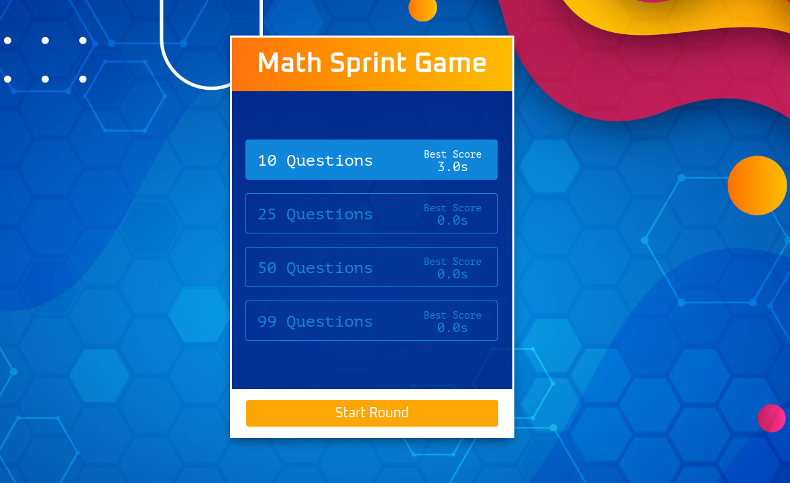

# MATH SPRINT GAME

- Highlight usage of timing events
- Procedurally generating random correct and incorrect math equations
- User has to choose if the equation is correct or incorrect
- navigate different views
- best scrore stored in local storage

Live - https://overdrivemachines.github.io/math-sprint-game/

## References

- Perfect Background Image CSS: https://css-tricks.com/perfect-full-page-background-image/
- CSS Gradiant Generator: https://mycolor.space/gradient?ori=to+right&hex=%23FF7310&hex2=%23FCBD00&sub=1
- Shuffle Array: https://stackoverflow.com/questions/2450954/how-to-randomize-shuffle-a-javascript-array
